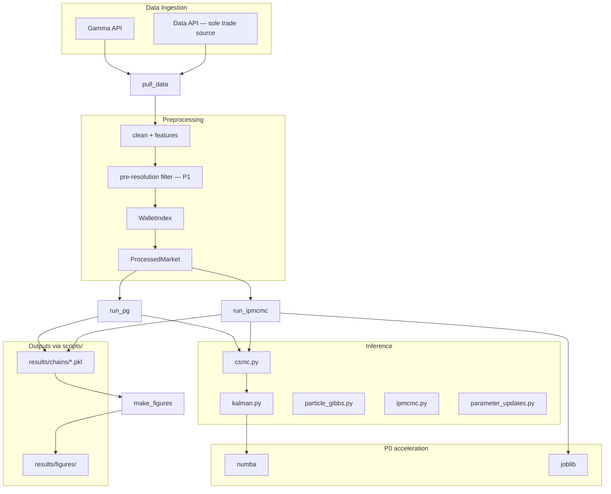

# PMCMC–Polymarket: Architecture Reference for AI Agents

> **Canonical doc for agents.** Read this first, then check [STATUS.md](STATUS.md) for what's in flight.
>
> | Doc | Update when… |
> |-----|--------------|
> | **[STATUS.md](STATUS.md)** | Priorities change, work completes, decisions made |
> | **This file** | Architecture, modules, model, API quirks, numerical edge cases |
> | [README.md](../README.md) | Human-facing overview (optional; may lag) |
>
> **Self-contained:** Everything needed to understand and work on the codebase is in this file + STATUS.md. No other docs in `agent_reference/` are required.

---

<!-- LIVING: agents should read STATUS.md for current priorities -->

## 0. How to Keep This Doc Current

### What to edit where

| You changed… | Update |
|--------------|--------|
| Finished a roadmap item | [STATUS.md](STATUS.md) — status column + changelog row |
| New priority or reprioritization | [STATUS.md](STATUS.md) — roadmap table |
| New binding decision | [STATUS.md](STATUS.md) decisions table + §3 below if architectural |
| New module, moved file, renamed API | §8 Module map + relevant §6/§9 section here |
| Model equation or parameter | §5 Statistical model |
| New CLI flag or preset | §10 CLI workflows |
| New limitation or fixed bug | §14 Active work (mirror STATUS.md) + §6.1 / §9.5 if architectural |
| API quirk or real-data numerical fix | §9.5 or §6.1 here; optional one-liner in STATUS changelog |

### Conventions

- **STATUS.md** = volatile (edit often, short).
- **ARCHITECTURE.md** = stable reference (edit when structure changes).
- Append to STATUS changelog; don't rewrite history.
- Use status tokens: `PLANNED` | `WIP` | `DONE`.
- **`scripts/` is the only entrypoint** — do not add alternative workflows.

### Section index

| § | Topic | Changes often? |
|---|-------|----------------|
| 1 | Goals | Rarely |
| 2 | Roadmap | → use [STATUS.md](STATUS.md) |
| 3 | Resolved decisions | Occasionally |
| 4 | System diagram | When pipeline changes |
| 5 | Statistical model | When model changes |
| 6 | Inference | When algorithms change |
| 7 | Speed guide | When optimization lands |
| 8 | Module map | When files added/removed |
| 9 | Data pipeline | When ingest changes |
| 10 | CLI | When scripts change |
| 11–17 | Decisions, validation, rules, trading | Mixed |

---

## 1. Project Goals

**Origin:** STAT 31511 independent project — **submitted and complete.**

**Current goals:**

1. **Refine the research paper** — `Monte_Carlo_Simulation/writeup.tex`
2. **Refine the codebase** — fix approximations, improve data quality
3. **Optimize speed** — **highest immediate priority** (see [STATUS.md](STATUS.md))
4. **Future: trading algorithm** — real-time insider scoring on live Polymarket trades

**Workflow:** All execution goes through **`scripts/`** CLIs (`pull_data`, `run_pg`, `run_ipmcmc`, `make_figures`). This is the only supported entrypoint.

---

## 2. Priority Roadmap

**See [STATUS.md](STATUS.md)** for live statuses and changelog.

Summary (fixed order unless user directs otherwise):

| P | Item |
|---|------|
| P0 | Speed — numba + joblib |
| P1 | Pre-resolution data filter |
| P2 | Half-prod inference runs |
| P3 | `theta_w` fix + `β_S` investigation |
| P4 | Paper figures |
| P5 | γ / s₀² sensitivity script |
| P6 | Trading infrastructure |

**Default refinement run (half-prod):**

```bash
python -m scripts.run_ipmcmc --config prod \
  --n-iter 1500 --n-burnin 300 --n-particles 250
```

---

## 3. Resolved Decisions

| # | Question | Decision |
|---|----------|----------|
| 1 | Negative `β_S` | Open empirical question; investigate with half-prod before model changes |
| 2 | Resolution over-flagging | Implement pre-resolution filter (P1) |
| 3 | Canonical inference run | Half-prod default |
| 4 | numba / joblib | Implement (P0); keep in requirements |
| 5 | Approximate `theta_w` update | Fix in P3 |
| 6 | CSMC reference index | **0** — code authoritative, paper follows |
| 7 | Doc hierarchy | ARCHITECTURE.md + STATUS.md for agents |
| 8 | γ / s₀² sweeps | In scope (P5), not cut |
| 9 | Goldsky / CLOB | Not used; Data API only |
| 10 | Course scope cuts | No longer apply |
| 11 | Alternative entrypoints | None — `scripts/` CLIs only |

Model is a **baseline spec** (§5), not immutable — changes OK if synthetic tests pass.

---

## 4. System Overview



**Synthetic path:** `--synthetic` → `src/data/synthetic.py` (ground-truth latents for validation).

---

## 5. Statistical Model (Baseline Spec)

### 5.1 Observations

| Symbol | Code | Meaning |
|--------|------|---------|
| $p_i$ | `p` | Trade price ∈ (0,1) |
| $S_i$ | `S` | Size (USDC) |
| $w_i$ | `wallet_ids` | Wallet (integer index) |
| $\Delta_i$ | `delta` | Inter-trade seconds; `delta[0]=0` |
| $Y_i$ | `Y` | `logit(p_i)` |

### 5.2 Latents

| Symbol | Code | Meaning |
|--------|------|---------|
| $X_{t_i}$ | `X` | Logit true probability |
| $V_{t_i}$ | `V` | Regime: 0=calm, 1=news |
| $Z_i$ | `Z` | Insider indicator |
| $\theta_w$ | `theta_w` | Wallet insider propensity |

$Z_0 := 0$ always.

### 5.3 Generative structure

```
θ_w ~ Beta(a, b)
X_{t_0} ~ N(0, s0_2);  V_{t_0} ~ Bernoulli(ρ_V);  Z_0 = 0
V_{t_i} | V_{t_{i-1}} ~ Markov(q_01, q_10)
X_{t_i} | X_{t_{i-1}}, V_{t_i} ~ N(X_{t_{i-1}}, σ²_{V_{t_i}} · Δ_i)
Z_i | · ~ Bernoulli(π^Z_i);  logit(π^Z_i) = logit(θ_{w_i}) + β_S log(S/S̄) + β_Z 1{Z_{i-1}=1}
Y_i | · ~ N(X_{t_i}, τ²_{Z_i} / max(1 + γ log(S/S̄), 0.1))
```

$\phi = (\sigma^2_0, \sigma^2_1, q_{01}, q_{10}, \beta_S, \beta_Z, \tau^2_0, \tau^2_1, a, b)$. Fixed for now: $\gamma=1$, $s_0^2=1$.

### 5.4 Outputs

1. $\mathbb{P}(Z_i=1 \mid \mathcal{D})$ — anomaly / trading signal
2. $\mathbb{E}[\pi_{t_i} \mid \mathcal{D}]$ — smoothed price
3. $\mathbb{E}[\theta_w \mid \mathcal{D}]$ — wallet ranking
4. $\mathbb{P}(V_{t_i}=1 \mid \mathcal{D})$ — regime

Via `src/analysis/results.py` and `plots.py`.

---

## 6. Inference Architecture

| Module | Role | Notes |
|--------|------|-------|
| `kalman.py` | RBPF Kalman + FFBS | P0: numba target; `log_lik` floor = -500 |
| `smc.py` | Bootstrap SMC | Sanity check / iPMCMC unconditional chains |
| `csmc.py` | Conditional SMC | `REFERENCE_INDEX = 0`; 4-state optimal proposal |
| `particle_gibbs.py` | PG sampler | Defines `MarketData` |
| `ipmcmc.py` | iPMCMC + swap | M=8, P=4; P0: parallelize |
| `parameter_updates.py` | Gibbs/MH | `theta_w` = per-wallet RWMH on logit scale (full logistic Z model; correct for β≠0) |
| `diagnostics.py` | R-hat, ESS | arviz |

**PG iteration:** CSMC → sample path → FFBS → `gibbs_sweep` (per market, params pooled).

**iPMCMC iteration:** M SMC passes → swap references → FFBS → Gibbs per conditional slot.

### 6.1 Real-data numerical edge cases

These only surfaced on live Polymarket data (synthetic data does not trigger them). Do not remove without replacement tests.

| Issue | Location | Fix |
|-------|----------|-----|
| Extreme price jumps (e.g. 0.001→0.999) make Gaussian `log_lik` → `-inf` → NaN weights | `kalman.py` | Cap `log_lik` at `_LOG_LIK_FLOOR = -500` |
| Same-second trades have `delta=0`; dividing by zero in σ² Gibbs update → NaN params | `parameter_updates.py` | Drop `delta=0` steps from σ² sufficient statistics |

Regression tests: `test_parameter_updates.py` (delta-zero case); SMC/CSMC suites cover Kalman floor.

---

## 7. Speed Optimization (P0)

**Cost model:** O(iterations × M × K × T × N × 4) `kalman_step` calls.

**Targets (in order):**

1. `numba.njit` on `kalman_step`
2. `joblib.Parallel` — M chains in `ipmcmc.py`
3. `joblib.Parallel` — K markets in PG/iPMCMC
4. Profile first (`cProfile` / `py-spy` on one dev iteration)

**Benchmark:** `scripts/benchmark.py` — wall-clock per PG run / iteration, cProfile
cost breakdown (kalman / resample / gibbs buckets), BLAS thread pinning via
`--threads`, and an optional `--gate` synthetic accuracy check (ROC AUC, insider
ranking, `theta_w` Spearman). Run before/after hot-path changes. NB: cProfile
`tottime`-by-file under-attributes Kalman work that executes inside NumPy C kernels
(lands in `other`); use it for relative trends, not exact attribution.

**Trading implication (P6):** Full MCMC too slow live → filter-only CSMC, warm-started chains, or surrogate model. Keep inference kernels callable outside MCMC wrapper.

---

## 8. Module Map

```
config/default_params.py
src/utils/transforms.py
src/data/polymarket_api.py    # Gamma + Data API only
src/data/preprocess.py
src/data/synthetic.py
src/inference/{kalman,smc,csmc,particle_gibbs,ipmcmc,parameter_updates,diagnostics}.py
src/analysis/{results,plots}.py
scripts/{_shortlist,_runner,pull_data,run_pg,run_ipmcmc,make_figures}.py
tests/
Monte_Carlo_Simulation/       # LaTeX paper
agent_reference/              # ARCHITECTURE.md + STATUS.md + CODE_QUALITY.md
```

### Key interfaces

```python
# particle_gibbs.py
@dataclass
class MarketData:
    Y: np.ndarray
    delta: np.ndarray
    log_size_ratio: np.ndarray
    wallet_ids: np.ndarray
```

- `ProcessedMarket.to_market_data()` — real data
- `WalletIndex` — global address → int; `wallet_index.json`
- `pickle_run()` / `load_run()` — `scripts/_runner.py`

---

## 9. Data Pipeline

| API | Role |
|-----|------|
| Gamma | Metadata, slug → conditionId |
| Data | **Sole trade source** |

**Cleaning:** drop invalid → dedupe `transaction_hash` → sort `(timestamp, hash)` → features → wallet IDs.

**P1 (done):** `--pre-resolution-days N` — drop trades within N days of market
resolution (default 7). `filter_pre_resolution` runs after `clean_trades`, before
feature computation; resolution time comes from Gamma `endDate` threaded through
`pull_data.py`. Pass `--pre-resolution-days 0` to disable the N-day buffer.

### 9.4 API quirks (Gamma + Data)

| Quirk | Workaround |
|-------|------------|
| `tag_slug=politics` silently ignored | Filter on `question` keywords (`POLITICS_KEYWORDS` in `polymarket_api.py`) |
| `order=volume` ignored | Use `order=volumeNum&ascending=false` |
| `volume_num_min=X` | Works server-side; pass when `min_volume > 0` |
| `/markets?slug=X` returns `[]` | Fast path: `/events?slug=X`; fallback: paginated `/markets` scan |
| Trade `offset` capped at 3000 (HTTP 400 beyond) | Trades are newest-first — cap yields final ~3000 trades; use `--tail-trades 2000` |

Per-market $T \leq 3000$. See also §6.1 for inference-side fixes on real data.

### 9.5 Real-data analysis notes

- **Resolution-period over-flagging:** Resolved markets pin at 0/1; model assigns low density → inflated $P(Z=1)$ near close. P1 adds pre-resolution filter; until then, interpret tail trades cautiously.
- **Wallet posteriors:** Meaningful when `n_trades` ≥ ~100; prior-dominated below ~20. Filter rankings via `wallet_ranking()` output.

---

## 10. CLI Workflows

```bash
pip install -r requirements.txt
python -m scripts.pull_data --output-dir data/processed --tail-trades 2000
python -m scripts.run_pg --config dev                          # fast check
python -m scripts.run_ipmcmc --config prod \
  --n-iter 1500 --n-burnin 300 --n-particles 250                 # half-prod
python -m scripts.run_pg --synthetic --config dev              # validation
python -m scripts.make_figures --chain results/chains/*.pkl
python -m pytest tests/ -q
```

| Preset | N | n_iter | n_burnin | Use |
|--------|---|--------|----------|-----|
| dev | 50 | 200 | 50 | Fast (~22 min PG) |
| half-prod | 250 | 1500 | 300 | **Default refinement** |
| prod | 500 | 3000 | 500 | If half-prod noisy |

---

## 11. Design Decisions

| # | Decision | Choice |
|---|----------|--------|
| 1 | Kalman per particle | Independent (μ, σ²) |
| 2 | CSMC proposal | Locally optimal, 4 states |
| 3 | Resampling | Systematic; ESS < N/2 |
| 4 | Reference index | 0 |
| 5 | iPMCMC | M=8, P=4 |
| 6 | Params | Conjugate + MH |
| 7 | N | 50 / 250 / 500 |
| 8 | Multi-market | K independent SMC; pooled Gibbs |
| 9 | Data | Data API only |
| 10 | Entrypoints | `scripts/` CLIs only |

---

## 12. Validation

Correct **iff** synthetic injection passes:

1. `pytest tests/ -q`
2. ROC AUC > 0.85; insider wallets ranked top
3. No speed regression on dev-iteration benchmark (once `benchmark.py` exists)

---

## 13. Coding Conventions

> **Full style standard: [CODE_QUALITY.md](CODE_QUALITY.md)** — PEP 8, Google
> docstrings, import ordering, helper extraction, performance rules. The table
> below is the quick reference; CODE_QUALITY.md is authoritative on *how code is
> written*.

| Rule | Detail |
|------|--------|
| RNG | `default_rng(seed)`; pass `rng` explicitly |
| Weights | Log-space + `logsumexp` |
| Vectorization | Particle dim = NumPy, not Python loops |
| Logic location | `src/` only (`scripts/` is a thin CLI layer) |
| Persistence | Pickle chains; Parquet data |
| Style / docstrings | PEP 8 + Google docstrings — see [CODE_QUALITY.md](CODE_QUALITY.md) |

---

## 14. Active Work

**See [STATUS.md](STATUS.md)** for live tracker. Summary:

| Issue | Priority |
|-------|----------|
| numba + joblib | P0 |
| Pre-resolution filter | P1 — DONE |
| `theta_w` approx fix | P3 — DONE (RWMH, full logistic) |
| Negative `β_S` | P3 — open |

---

## 15. Test Map

| File | Covers |
|------|--------|
| `test_kalman.py` | Kalman, FFBS |
| `test_smc.py` | Bootstrap SMC |
| `test_csmc.py` | Reference index 0 |
| `test_parameter_updates.py` | Gibbs/MH, delta=0 |
| `test_particle_gibbs.py` | PG end-to-end |
| `test_ipmcmc.py` | Swap, degeneracy |
| `test_synthetic.py` | Generator |
| `test_preprocess.py` | Cleaning, Parquet |
| `test_polymarket_api.py` | API client |
| `test_results.py` | Summaries, ROC |
| `test_plots.py` | Figures |
| `test_scripts.py` | CLI smoke tests |

---

## 16. Agent Rules

1. Read [STATUS.md](STATUS.md) then this file.
2. P0 speed is default when user says "optimize" without specifics.
3. Update STATUS.md when completing roadmap items.
4. Update this file when architecture/modules/model change.
5. Do not wire Goldsky / CLOB without explicit request — Data API only.
6. Model changes need synthetic validation.

| Task | Start here |
|------|------------|
| Speed | `kalman.py` → `csmc.py` → `ipmcmc.py` → §7 |
| Inference bug | `particle_gibbs.py` / `ipmcmc.py` → `csmc.py` |
| Data | `polymarket_api.py` → `preprocess.py` |
| Figures | `make_figures.py` → `plots.py` |

---

## 17. Future: Trading Algorithm (P6)

**Input:** Live trades (Data API / future WebSocket).

**Output:** $P(Z_i=1 \mid \mathcal{D}_{\leq i})$ per trade.

```
Live trades → preprocess features → filter-only CSMC or warm-started MCMC
           → P(Z=1) + θ_w lookup → signal layer (user-defined)
```

**Refactor now:** kernels callable without MCMC wrapper; numba; open markets only; online wallet index.

---

## 18. Related Documents

| File | Role | Required? |
|------|------|-----------|
| [STATUS.md](STATUS.md) | Living priorities and changelog | Yes (for agents) |
| **ARCHITECTURE.md** | Stable reference (this file) | Yes |
| [CODE_QUALITY.md](CODE_QUALITY.md) | Python style standard (PEP 8, docstrings, imports, perf) | Yes (when writing code) |
| [README.md](../README.md) | Long-form human overview | Optional |
| `config/default_params.py` | Config defaults and presets | When changing inference settings |
| `Monte_Carlo_Simulation/writeup.tex` | Research paper | When updating prose/figures |
