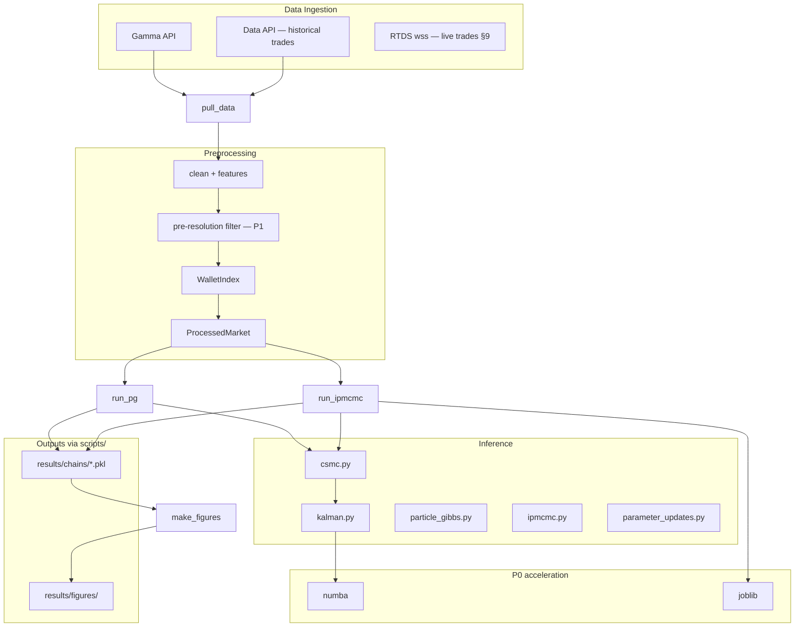

# PMCMC–Polymarket: Architecture Reference for AI Agents

> **Canonical doc for agents.** Read this first, then check [STATUS.md](STATUS.md) for what's in flight.
>
> | Doc | Update when… |
> |-----|--------------|
> | **[STATUS.md](STATUS.md)** | Priorities change, work completes, decisions made |
> | **This file** | Architecture, modules, model, API quirks, numerical edge cases |
> | [README.md](../README.md) | Human-facing overview (optional; may lag) |
>
> **Self-contained:** Everything needed to understand and work on the codebase is in this file + STATUS.md. No other docs in `agent_reference/` are required.

---

<!-- LIVING: agents should read STATUS.md for current priorities -->

## 0. How to Keep This Doc Current

### What to edit where

| You changed… | Update |
|--------------|--------|
| Finished a roadmap item | [STATUS.md](STATUS.md) — status column + changelog row |
| New priority or reprioritization | [STATUS.md](STATUS.md) — roadmap table |
| New binding decision | [STATUS.md](STATUS.md) decisions table + §3 below if architectural |
| New module, moved file, renamed API | §8 Module map + relevant §6/§9 section here |
| Model equation or parameter | §5 Statistical model |
| New CLI flag or preset | §10 CLI workflows |
| New limitation or fixed bug | §14 Active work (mirror STATUS.md) + §6.1 / §9.5 if architectural |
| API quirk or real-data numerical fix | §9.5 or §6.1 here; optional one-liner in STATUS changelog |

### Conventions

- **STATUS.md** = volatile (edit often, short).
- **ARCHITECTURE.md** = stable reference (edit when structure changes).
- Append to STATUS changelog; don't rewrite history.
- Use status tokens: `PLANNED` | `WIP` | `DONE`.
- **`scripts/` is the only entrypoint** — do not add alternative workflows.

### Section index

| § | Topic | Changes often? |
|---|-------|----------------|
| 1 | Goals | Rarely |
| 2 | Roadmap | → use [STATUS.md](STATUS.md) |
| 3 | Resolved decisions | Occasionally |
| 4 | System diagram | When pipeline changes |
| 5 | Statistical model | When model changes |
| 6 | Inference | When algorithms change |
| 7 | Speed guide | When optimization lands |
| 8 | Module map | When files added/removed |
| 9 | Data pipeline | When ingest changes |
| 10 | CLI | When scripts change |
| 11–17 | Decisions, validation, rules, trading | Mixed |

---

## 1. Project Goals

**Origin:** STAT 31511 independent project — **submitted and complete.**

**Current goals:**

1. **Refine the research paper** — `Monte_Carlo_Simulation/writeup.tex`
2. **Refine the codebase** — fix approximations, improve data quality
3. **Optimize speed** — **highest immediate priority** (see [STATUS.md](STATUS.md))
4. **Trading algorithm** — real-time insider scoring on live Polymarket trades (streaming path shipped 2026-07-28; see §17)

**Workflow:** All execution goes through **`scripts/`** CLIs (`pull_data`, `run_pg`, `run_ipmcmc`, `make_figures`). This is the only supported entrypoint.

---

## 2. Priority Roadmap

**See [STATUS.md](STATUS.md)** for live statuses and changelog.

Summary (fixed order unless user directs otherwise):

| P | Item |
|---|------|
| P0 | Speed — numba + joblib |
| P1 | Pre-resolution data filter |
| P2 | Half-prod inference runs |
| P3 | `theta_w` fix + `β_S` investigation |
| P4 | Paper figures |
| P5 | γ / s₀² sensitivity script |
| P6 | Trading infrastructure (streaming path shipped — §17; tracked as STATUS P14) |
| P8–P13 | Post-VEM-validation open items (Laplace/PSIS foundation, `SS_v` smoothed moments, `sigma2` order clamp, `tau2` prior, artifact re-runs, `slow` marker) — see [STATUS.md](STATUS.md) |

**Default refinement run (VEM, canonical since 2026-07-23):**

```bash
python -m scripts.benchmark --method vem --config half-prod
python -m scripts.validate_vem --config dev        # validation ladder (§12)
```

**Historical / frozen (PG-iPMCMC baseline — do not use for new computation):**

```bash
python -m scripts.run_ipmcmc --config prod \
  --n-iter 1500 --n-burnin 300 --n-particles 250
```

---

## 3. Resolved Decisions

| # | Question | Decision |
|---|----------|----------|
| 1 | Negative `β_S` | Open empirical question; investigate with half-prod before model changes |
| 2 | Resolution over-flagging | Implement pre-resolution filter (P1) |
| 3 | Canonical inference run | **VEM fast path** (superseded 2026-07-23; was "half-prod PG/iPMCMC default"). PG/iPMCMC frozen as cited historical baseline; half-prod remains the default *preset size*, not the default *engine* |
| 4 | numba / joblib | Implement (P0); keep in requirements |
| 5 | Approximate `theta_w` update | Fix in P3 |
| 6 | CSMC reference index | **0** — code authoritative, paper follows |
| 7 | Doc hierarchy | ARCHITECTURE.md + STATUS.md for agents |
| 8 | γ / s₀² sweeps | In scope (P5), not cut |
| 9 | Goldsky / CLOB | Not used; Data API only |
| 10 | Course scope cuts | No longer apply |
| 11 | Alternative entrypoints | None — `scripts/` CLIs only |

Model is a **baseline spec** (§5), not immutable — changes OK if synthetic tests pass.

---

## 4. System Overview


```mermaid
flowchart TB
    subgraph ingest [Data Ingestion]
        G[Gamma API]
        D[Data API — historical trades]
        RT[RTDS wss — live trades §9]
    end

    subgraph prep [Preprocessing]
        C[clean + features]
        PR[pre-resolution filter — P1]
        W[WalletIndex]
        P[ProcessedMarket]
    end

    subgraph infer [Inference]
        KF[kalman.py]
        CSMC[csmc.py]
        PG[particle_gibbs.py]
        IP[ipmcmc.py]
        GIB[parameter_updates.py]
    end

    subgraph accel [P0 acceleration]
        NB[numba]
        JL[joblib]
    end

    subgraph out [Outputs via scripts/]
        PKL[results/chains/*.pkl]
        FIG[results/figures/]
    end

    G & D --> pull_data --> C --> PR --> W --> P
    P --> run_pg & run_ipmcmc --> CSMC --> KF
    KF --> NB
    run_ipmcmc --> JL
    run_pg & run_ipmcmc --> PKL --> make_figures --> FIG
```

**Synthetic path:** `--synthetic` → `src/data/synthetic.py` (ground-truth latents for validation).

---

## 5. Statistical Model (Baseline Spec)

### 5.1 Observations

| Symbol | Code | Meaning |
|--------|------|---------|
| $p_i$ | `p` | Trade price ∈ (0,1) |
| $S_i$ | `S` | Size (USDC) |
| $w_i$ | `wallet_ids` | Wallet (integer index) |
| $\Delta_i$ | `delta` | Inter-trade seconds; `delta[0]=0` |
| $Y_i$ | `Y` | `logit(p_i)` |

### 5.2 Latents

| Symbol | Code | Meaning |
|--------|------|---------|
| $X_{t_i}$ | `X` | Logit true probability |
| $V_{t_i}$ | `V` | Regime: 0=calm, 1=news |
| $Z_i$ | `Z` | Insider indicator |
| $\theta_w$ | `theta_w` | Wallet insider propensity |

$Z_0 := 0$ always.

### 5.3 Generative structure

```
θ_w ~ Beta(a, b)
X_{t_0} ~ N(0, s0_2);  V_{t_0} ~ Bernoulli(ρ_V);  Z_0 = 0
V_{t_i} | V_{t_{i-1}} ~ Markov(q_01, q_10)
X_{t_i} | X_{t_{i-1}}, V_{t_i} ~ N(X_{t_{i-1}}, σ²_{V_{t_i}} · Δ_i)
Z_i | · ~ Bernoulli(π^Z_i);  logit(π^Z_i) = logit(θ_{w_i}) + β_S log(S/S̄) + β_Z 1{Z_{i-1}=1}
Y_i | · ~ N(X_{t_i}, τ²_{Z_i} / max(1 + γ log(S/S̄), 0.1))
```

$\phi = (\sigma^2_0, \sigma^2_1, q_{01}, q_{10}, \beta_S, \beta_Z, \tau^2_0, \tau^2_1, a, b)$. Fixed for now: $\gamma=1$, $s_0^2=1$.

**Spec vs. implementation:** the VEM M-step centers/standardizes the logistic covariates internally (Gelman et al. 2008) and reports coefficients on the original scale — the model spec above is unchanged by this. Priors on $\phi$ live in one place: `PhiPrior` in `config/default_params.py` (shared by the M-step, the Laplace layer and PSIS).

**Anonymous-venue mode (2026-08-03).** `ModelParams.anonymous` replaces the per-wallet offset with one estimated market-level intercept $\alpha$, for venues with no persistent account key (Kalshi — §9.6):

```
logit(π^Z_i) = α + β_S log(S/S̄) + β_Z 1{Z_{i-1}=1}
```

$\theta_w$ plays no role there. One flag, four consumers (`synthetic.py`, `variational_em.py`, `adf_filter.py`, `online_scorer.py`); the single switch is `config/default_params.z_logit_level()`, and `warm_start(anonymous=True)` seeds it. Prior: `PhiPrior.alpha_cauchy_scale = 10.0` — Cauchy(0, 10) kept after a 24-seed oracle-$q(Z)$ recovery sweep (α bias −0.161 / −0.043 / +0.012 at $T$ = 200 / 1000 / 3000; KTD2). Wallet mode stays the default and is bit-identical (pinned fixture + frozen-limit regression).

### 5.4 Outputs

1. $\mathbb{P}(Z_i=1 \mid \mathcal{D})$ — anomaly / trading signal
2. $\mathbb{E}[\pi_{t_i} \mid \mathcal{D}]$ — smoothed price
3. $\mathbb{E}[\theta_w \mid \mathcal{D}]$ — wallet ranking
4. $\mathbb{P}(V_{t_i}=1 \mid \mathcal{D})$ — regime

Via `src/analysis/results.py` and `plots.py`.

---

## 6. Inference Architecture

| Module | Role | Notes |
|--------|------|-------|
| `kalman.py` | RBPF Kalman + FFBS | P0: numba target; `log_lik` floor = -500 |
| `smc.py` | Bootstrap SMC | Sanity check / iPMCMC unconditional chains |
| `csmc.py` | Conditional SMC | `REFERENCE_INDEX = 0`; 4-state optimal proposal |
| `particle_gibbs.py` | PG sampler | **Historical/frozen** (2026-07-23) — cited baseline only; defines `MarketData`, still used by the VEM path |
| `ipmcmc.py` | iPMCMC + swap | **Historical/frozen** (2026-07-23) — M=8, P=4 |
| `variational_em.py` | Variational EM (C1) — **canonical engine** | ADF E-step + moment-matched **+ IRLS-Cauchy logistic M-step** (Gelman et al. 2008); `beta_S`/`beta_Z` estimated **when opted in** (`estimate_betas=False` default); `theta_w` offset-adjusted (logit-normal); 50 EM iterations default; gate: AUC 0.885, 68.8 s mean (single-initialization, deterministic warm start, at the iteration cap) |
| `laplace.py` | Curvature Gaussian over unconstrained `phi` | `PhiPosterior`, `laplace_from_vem`; block-diagonal. **Foundation unsound** — ECM curvature, not observed information; see §14 / STATUS P8 |
| `parameter_updates.py` | Gibbs/MH | `theta_w` = per-wallet RWMH on logit scale (full logistic Z model; correct for β≠0) |
| `adf_filter.py` | Stepwise ADF filter | Extracted from the VEM E-step, **output-identical** (exact-equality fixture); `step` / `set_params` / `set_theta_logits`; bit-exact `_logsumexp4` hot path (§13) |
| `online_scorer.py` | Online EM (Cappé–Moulines) | Per-trade $P(Z_i=1\mid\mathcal{D}_{\leq i})$ over `ADFFilter`; decayed **sums**, `rho` schedules `fixed`/`robbins_monro` with `rho_t0`; consumes public `variational_em.update_beta_irls` |
| `stream_scoring.py` | Streaming-scorer library | `StreamScorer`, `WarmStart` artifact, `warm_start_payload`; backs `scripts/score_stream.py` (§17) |
| `diagnostics.py` | R-hat, ESS | arviz |

**PG iteration (historical):** CSMC → sample path → FFBS → `gibbs_sweep` (per market, params pooled).

**iPMCMC iteration (historical):** M SMC passes → swap references → FFBS → Gibbs per conditional slot.

**VEM iteration:** Approximate E-step (ADF) → M-step (moment matching for `sigma2`/`tau2`/`q`, weighted-logistic IRLS with a Cauchy(0, 2.5) prior for `beta_S`/`beta_Z` when enabled, offset-adjusted Newton for `theta_w`); runs 50 iterations over full dataset.

### 6.1 Real-data numerical edge cases

These only surfaced on live Polymarket data (synthetic data does not trigger them). Do not remove without replacement tests.

| Issue | Location | Fix |
|-------|----------|-----|
| Extreme price jumps (e.g. 0.001→0.999) make Gaussian `log_lik` → `-inf` → NaN weights | `kalman.py` | Cap `log_lik` at `_LOG_LIK_FLOOR = -500` |
| Same-second trades have `delta=0`; dividing by zero in σ² Gibbs update → NaN params | `parameter_updates.py` | Drop `delta=0` steps from σ² sufficient statistics |

**Cross-cutting invariant (promoted 2026-07-28):** the `delta=0` variance exclusion is not
local to `parameter_updates.py` — every consumer of σ² sufficient statistics must honor it,
including `adf_filter.py` and `online_scorer.py` on the streaming path.

Regression tests: `test_parameter_updates.py` (delta-zero case); SMC/CSMC suites cover Kalman floor.

### 6.2 VEM numerical / identifiability notes

Observed 2026-07-25 on synthetic data; these are properties of the estimator, not transient bugs.

| Issue | Location | Status |
|-------|----------|--------|
| `sigma2_1 = max(sigma2_1, sigma2_0)` order constraint binds **exactly** at every fitted point (`sigma2_0 == sigma2_1` to the last bit, 5/5 dev restarts, and still at convergence). The V regime is then non-identified: the ADF log-marginal moves < 5e-13 over ±4 sd in both `logit q_01` and `logit q_10`. ~75% of Laplace draws violate the estimator's own order constraints | `variational_em.py`, `laplace.py` | Open — identifiability/model decision (STATUS P10) |
| `SS_v` uses filtered rather than smoothed moments and omits the lag-one cross-covariance `-2Cov(X_t, X_{t-1})` — most likely cause of the `sigma2` mis-centring | `variational_em.py` | Open — inference-path change, would move gate numbers (STATUS P9) |
| `m_Z` (the `E[Z_prev]` centering constant) is refreshed between the E-step and the same iteration's M-step, so the module's blockwise-monotonicity claim holds only conditionally. Latent today (induced shift 1.7e-5 at `beta_Z=0`) but live as soon as beta estimation is enabled | `variational_em.py` | Docstring corrected; reorder deferred |
| ADF E-step does not identify `Z` on the synthetic generator (`q(Z)` near-flat) → spurious `beta_S` ≈ −0.40 | `variational_em.py` | Beta estimation opt-in; gate FAILS with `--estimate-betas` (AUC 0.547 vs 0.9435) |

---

## 7. Speed Optimization (P0)

**Cost model:** O(iterations × M × K × T × N × 4) `kalman_step` calls.

**Targets (in order):**

1. `numba.njit` on `kalman_step`
2. `joblib.Parallel` — M chains in `ipmcmc.py`
3. `joblib.Parallel` — K markets in PG/iPMCMC
4. Profile first (`cProfile` / `py-spy` on one dev iteration)

**Benchmark:** `scripts/benchmark.py` — wall-clock per PG run / iteration, cProfile
cost breakdown (kalman / resample / gibbs buckets), BLAS thread pinning via
`--threads`, and an optional `--gate` synthetic accuracy check (ROC AUC, insider
ranking, `theta_w` Spearman). Run before/after hot-path changes. NB: cProfile
`tottime`-by-file under-attributes Kalman work that executes inside NumPy C kernels
(lands in `other`); use it for relative trends, not exact attribution.

**Trading implication (P6):** Full MCMC too slow live → filter-only CSMC, warm-started chains, or surrogate model. Keep inference kernels callable outside MCMC wrapper.

---

## 8. Module Map

```
config/default_params.py      # presets + PhiPrior (single authoritative prior spec)
src/utils/transforms.py
src/data/polymarket_api.py    # Gamma + Data API (historical); + fetch_trades_windowed
src/data/kalshi_api.py        # Kalshi public GetTrades (no auth); wallet = None (§9.6)
src/data/rtds.py              # RTDS websocket live trade adapter
src/data/trade_stream.py      # trade-stream ordering / corruption policy
src/data/preprocess.py
src/data/synthetic.py         # + params_from_prior / prior-predictive generator mode
src/inference/{kalman,smc,csmc,particle_gibbs,ipmcmc,variational_em,laplace,parameter_updates,diagnostics}.py
src/inference/{adf_filter,online_scorer,stream_scoring}.py
src/analysis/{prefilter,results,plots,validation,sbc,event_study,case_study,backtest}.py
scripts/{_shortlist,_runner,pull_data,run_pg,run_ipmcmc,benchmark,validate_vem,pareto,eval_c4,make_figures}.py
scripts/{stream_trades,score_stream,sbc}.py
scripts/{pull_kalshi,event_study,case_study,backtest}.py
tests/
Monte_Carlo_Simulation/       # LaTeX paper
agent_reference/              # ARCHITECTURE.md + STATUS.md + CODE_QUALITY.md
```

### Key interfaces

```python
# particle_gibbs.py
@dataclass
class MarketData:
    Y: np.ndarray
    delta: np.ndarray
    log_size_ratio: np.ndarray
    wallet_ids: np.ndarray
```

- `ProcessedMarket.to_market_data()` — real data
- `WalletIndex` — global address → int; `wallet_index.json`
- `pickle_run()` / `load_run()` — `scripts/_runner.py`
- `PhiPrior` — `config/default_params.py`; the one prior spec consumed by the VEM M-step, `laplace.py` and PSIS
- `PhiPosterior`, `laplace_from_vem()` — `src/inference/laplace.py`; block-diagonal curvature Gaussian over unconstrained `phi`
- `src/analysis/validation.py` — samplerless validation layer: `jittered_init`, `top_k_wallets`, `pooled_synthetic_auc`, `restart_record`, `spread`, `mean_pairwise_jaccard`, `stability_block`, `elbo_convergence`, `convergence_block`, `phi_centring_gradient`, plus held-out predictive LL and PSIS-k̂. **Import these from here, never from `scripts/`** (they were moved out of the CLI on 2026-07-25 for plan 3's benefit)
- `ADFFilter` — `src/inference/adf_filter.py`; stepwise ADF filter **extracted from the VEM E-step and output-identical to it** (exact-equality fixture pins this). Interface: `step()`, `set_params()`, `set_theta_logits()`. Hot path: `_logsumexp4` (see §13)
- `OnlineScorer` — `src/inference/online_scorer.py`; Cappé–Moulines online EM wrapper over `ADFFilter`. Carries decayed **sums, not averages** (the batch MAP maps consume sum-scale sufficient statistics — the module docstring is authoritative); `rho` schedules `fixed` and `robbins_monro` with `rho_t0` (default 50, ≥ 2, because `rho(0)=1` annihilated the seed). Consumes the now-public `variational_em.update_beta_irls`
- `src/inference/stream_scoring.py` — streaming-scorer library: `StreamScorer`, the `WarmStart` artifact format, `warm_start_payload()`. **Import from here, never from `scripts/`** (same contract as `validation.py`)
- `src/data/rtds.py` — RTDS websocket live adapter (§9)
- `src/data/trade_stream.py` — ordering/corruption policy for trade streams: `iter_jsonl`, `read_replay`, `tail_live`, `OutOfOrderTradeError`
- `src/analysis/sbc.py` — SBC replicate harness + rank-uniformity/coverage analysis; JSONL store, **schema v2 with an `(L, size, prior)` regime guard** (cross-regime stores are refused, not merged)
- `variational_em.update_beta_irls` — **PUBLIC** (cross-module contract with `online_scorer`); do not re-privatize. Returns an `IRLSFit` NamedTuple; the design gains a third (intercept) column in anonymous mode, and the fitted level surfaces as `VEMOutput.alpha_orig`
- `OnlineScorer.step_trade` — anonymous-mode scorer seam, `{ts, p, S, side}`, no wallet: the documented import point for the external Kalshi trading system (§17)
- `src/data/kalshi_api.py` — Kalshi public `GetTrades` client + normalization to the `RawTrade` schema with `wallet = None` (§9.6). `RawTrade.wallet` is now `str | None`; `clean_trades(require_wallet=…)` gates it
- `src/analysis/event_study.py` — no-lookahead event study: one pre-registered primary statistic (mean `P(Z)` elevation over `[t_close − W, t_close − w]`) against a within-market time-shifted-window permutation null; `WindowSpec.is_locked` marks any non-locked window "NOT LOCKED - EXPLORATORY". Max-elevation and cross-market shuffle are labeled robustness only. Permutation RNG keyed on a blake2b digest of the market id
- `src/analysis/case_study.py` — manifest-driven labeled-case report (`results/case_studies/van_dyke/markets.json`). `WalletRow.min_p_z` / `is_flat` and `CaseStudySummary.anchor_is_untested` detect a constant `logit π^Z` so a flat score is never read as a negative result (§14)
- `src/analysis/backtest.py` — threshold-entry PoC backtest: spread + Kalshi fee at cent granularity, purged + embargoed walk-forward, deflated Sharpe from the empirical variance across trial Sharpes (Bailey & López de Prado 2014)

---

## 9. Data Pipeline

| API | Role |
|-----|------|
| Gamma | Metadata, slug → conditionId |
| Data | **Sole HISTORICAL / backfill trade source** (`data-api.polymarket.com/trades`) |
| RTDS | **Live counterpart** — `wss://ws-live-data.polymarket.com`, `activity/trades` topic, no auth; `src/data/rtds.py`. First-party Polymarket feed, so resolved decision #9 (Data API only, no Goldsky/CLOB) is unchanged in spirit |
| Kalshi | **Anonymous-venue trade source** — public `GetTrades`, no auth; `src/data/kalshi_api.py` (§9.6) |

**Backfill:** `fetch_trades_windowed` walks timestamp windows to get full history past the
server offset ceiling — dedupe on `transaction_hash`, offset reset per window. Exposed as
`pull_data --full-history` (§10).

**Cleaning:** drop invalid → dedupe `transaction_hash` → sort `(timestamp, hash)` → features → wallet IDs.

**P1 (done):** `--pre-resolution-days N` — drop trades within N days of market
resolution (default 7). `filter_pre_resolution` runs after `clean_trades`, before
feature computation; resolution time comes from Gamma `endDate` threaded through
`pull_data.py`. Pass `--pre-resolution-days 0` to disable the N-day buffer.

### 9.4 API quirks (Gamma + Data)

| Quirk | Workaround |
|-------|------------|
| `tag_slug=politics` silently ignored | Filter on `question` keywords (`POLITICS_KEYWORDS` in `polymarket_api.py`) |
| `order=volume` ignored | Use `order=volumeNum&ascending=false` |
| `volume_num_min=X` | Works server-side; pass when `min_volume > 0` |
| `/markets?slug=X` returns `[]` | Fast path: `/events?slug=X`; fallback: paginated `/markets` scan |
| Two distinct offset limits | `DATA_API_MAX_OFFSET` (3000) is the deliberate **client-side tail budget** (trades are newest-first — yields the final ~3000 trades; pair with `--tail-trades 2000`). `DATA_API_OFFSET_LIMIT` (10000) is the **server ceiling**, reached only by `fetch_trades_windowed` |

Per-market $T \leq 3000$ on the default tail path. See also §6.1 for inference-side fixes on real data.

**Probe findings (2026-07-25, empirical against `data-api.polymarket.com/trades`):**

- Max usable `offset` = 10000; `offset=10001` → HTTP 400. The cap applies to `offset` **alone**, so `offset=10000&limit=500` returns 500 rows.
- Timestamp params are `start` / `end`, in **UNIX SECONDS**, and both bounds are **INCLUSIVE**. 26 other candidate names (`from`, `after`, `startTs`, …) are silently ignored; millisecond values behave as no filter at all.
- `start=0` / `end=0` are **falsy server-side** and are never sent — an epoch-start window uses `ts=1`.
- `transactionHash` is unique across taker-side rows, which is what makes it a valid dedupe key; `takerOnly=false` would break that uniqueness.
- Live cross-check: a windowed pull is **set-identical** to an unfiltered pull, 0 duplicates.

**RTDS message schema — VERIFIED live 2026-07-25:** field names match the REST payload
(`proxyWallet`, `conditionId`, `transactionHash`, `price`, `size`, `side`); trade `timestamp`
is in **seconds** while the envelope `ts` is in **milliseconds**; empty text frames are
keepalives, not malformed messages.

### 9.5 Real-data analysis notes

- **Resolution-period over-flagging:** Resolved markets pin at 0/1; model assigns low density → inflated $P(Z=1)$ near close. P1 adds pre-resolution filter; until then, interpret tail trades cautiously.
- **Wallet posteriors:** Meaningful when `n_trades` ≥ ~100; prior-dominated below ~20. Filter rankings via `wallet_ranking()` output.
- **VPIN (`prefilter.py`) is a gating signal only**, never a detector (filter-only ablation GATE FAIL, AUC 0.524). `vpin_scores(..., sides=)` uses the native taker side when present with a per-trade fallback to the price-change proxy; `vpin_robustness` reports both classifications. The Andersen–Bondarenko caveat applies, and any analysis using VPIN controls for volume (`volume_controlled_scores`, OLS residualization on log volume). Default behavior is golden-locked at rtol=0/atol=0.

### 9.6 Kalshi adapter (public `GetTrades`) — added 2026-08-03

`src/data/kalshi_api.py` + `scripts/pull_kalshi.py`; public and unauthenticated, normalizing to the same `RawTrade` schema as the Polymarket path.

- **No identity (TESTED INVARIANT).** Kalshi's public feed carries no account key, so every normalized row has `wallet = None`. Wallet-nullability is the anonymous-mode signal at load time (KTD3): `RawTrade.wallet: str | None`, `clean_trades(require_wallet=…)`, explicit CLI override.
- **Pagination:** opaque `cursor`; an **empty-string cursor means exhausted** (not a missing key). 429/5xx backoff mirrors `polymarket_api.py`.
- **Live schema ≠ documented schema (VERIFIED live 2026-08-01):** `yes_price_dollars` / `no_price_dollars` are decimal-string **DOLLARS**, not integer cents; `count_fp` is a fractional-contract string; `created_time` is RFC-3339 with sub-second precision, not UNIX seconds. The parser prefers the live fields and falls back to the legacy cents/integer form.
- **Taker fee:** `ceil(0.07 · C · p · (1 − p))` in **CENTS** (C = contracts) — the cost model consumed by `backtest.py`.
- Sample pull: `KXZELENSKYYOUT-26JUL01`, 40 raw → 29 rows.

---

## 10. CLI Workflows

```bash
pip install -r requirements.txt
python -m scripts.pull_data --output-dir data/processed --tail-trades 2000
python -m scripts.benchmark.py --method vem --config dev       # VEM gate (canonical); {pg,vem,filter,ipmcmc}
python -m scripts.validate_vem --config dev                    # validation ladder → results/validation/
python -m scripts.run_pg --config dev                          # historical/frozen: fast check
python -m scripts.run_pg --config half-prod --n-jobs 8         # historical/frozen: multi-market parallel
python -m scripts.run_ipmcmc --config prod \
  --n-iter 1500 --n-burnin 300 --n-particles 250                 # historical/frozen: half-prod
python -m scripts.run_pg --synthetic --config dev              # validation
python -m scripts.pareto.py --output results/figures/pareto.png
python -m scripts.make_figures --chain results/chains/*.pkl
python -m scripts.stream_trades --markets <cond_id>          # live RTDS capture → JSONL/Parquet
python -m scripts.score_stream --replay trades.jsonl \
  --warm-start results/warm_start.json --output scores.jsonl # per-trade P(Z|D<=i)
python -m scripts.sbc --n-sims 200 --n-jobs 8                 # SBC replicates (blocked — P8/P11)
python -m scripts.pull_kalshi --tickers KXZELENSKYYOUT-26JUL01 # Kalshi public trades → normalized schema
python -m scripts.event_study --scores scores.jsonl           # no-lookahead P(Z)-elevation test
python -m scripts.case_study --manifest results/case_studies/van_dyke/markets.json
python -m scripts.backtest --scores scores.jsonl              # costed deflated-Sharpe PoC
python -m pytest tests/ -q
```

| Preset | N | n_iter | n_burnin | Use |
|--------|---|--------|----------|-----|
| dev | 50 | 200 | 50 | Fast (~22 min PG) |
| half-prod | 250 | 1500 | 300 | **Default refinement size** (engine = VEM since 2026-07-23) |
| prod | 500 | 3000 | 500 | If half-prod noisy |

**Flags:**
- `run_pg --n-jobs K` — parallelize over K markets; default 1 (bit-exact sequential). Uses `dataclasses.replace` on config.
- `benchmark.py --method {pg|vem|filter|ipmcmc}` — fourth method (VEM); shared gate/timing/JSON instrumentation via `_artifacts_from_mcmc_chain`; warns on inert `--n-jobs`.
- `benchmark.py --estimate-betas` — enable the VEM logistic M-step for `beta_S`/`beta_Z`; **default False**. The VEM bench JSON records the effective value. Turning it on currently FAILS the synthetic gate (AUC 0.547 vs 0.9435) — see §6.2.
- `validate_vem.py --config {dev|half-prod|...}` — samplerless validation ladder (§12): ELBO traces, jittered-restart stability, held-out one-step predictive LL, PSIS-k̂ + `phi_centring_gradient`; writes `results/validation/*.json` with a `convergence_status` block.
- `pareto.py` — AUC-vs-wall-clock Pareto figure from bench JSONs; output to PNG + CSV.
- `eval_c4.py` — C4 full-scale eval (K=10, T=2000) [deferred].
- `pull_data --full-history` — windowed backfill from the epoch via `fetch_trades_windowed` instead of the newest-first tail. Per-market failure isolation: one market failing does not abort the pull, and the run summary is marked **INCOMPLETE**. `--tail-trades` is applied *post-retrieval*.
- `stream_trades.py` — live RTDS capture. `--markets` (condition IDs), `--parquet-every N` (rolling Parquet flush), `--max-trades N`, `--stale-after S` (reconnect on a silent socket); clean SIGINT shutdown that flushes before exit.
- `score_stream.py` — streaming insider scorer over `StreamScorer`. `--replay FILE` / `--live` (mutually exclusive), `--warm-start` (batch VEM artifact), `--forgetting` (`rho` decay), `--n-refresh` (M-step refresh cadence). Writes a scores JSONL plus a **deterministic `<output>.meta.json` sidecar**; in live mode it pre-seeds the dedupe set from an existing output so a restart skips already-scored trades.
- `sbc.py` — SBC replicate harness. `--n-sims`, `--n-jobs` (joblib), `--resume` (append to the JSONL store), `--analyze` (rank-uniformity + coverage tables and figures). **Refuses cross-regime stores** (schema-v2 `(L, size, prior)` guard). The coverage table prints Wilson-CI verdicts including `pass (underpowered)`. Currently non-executable end to end: `default_sbc_prior()` fails fast on the improper `tau2` prior (STATUS P8/P11).
- `pull_kalshi.py` — Kalshi public `GetTrades` pull, mirroring `pull_data` conventions (tickers, output dir, pre-resolution filter); every output row carries `wallet = None` (§9.6).
- `event_study.py` — pre-registered mean-`P(Z)`-elevation test vs the within-market time-shift permutation null. Window **W = 5 d / w = 1 d is LOCKED** (locked on synthetic before any real run); any other window is reported "NOT LOCKED - EXPLORATORY". Refuses score files whose `score_stream` sidecar is not replay-mode.
- `case_study.py` — manifest → pull → replay → report for the labeled Van Dyke / Maduro cluster. Warns when the anchored wallet's `logit π^Z` is flat, i.e. the case is untested rather than negative (§14).
- `backtest.py` — costed threshold-entry backtest with purged + embargoed walk-forward and deflated Sharpe. Detection PoC framing is mandatory in all outputs; the deflator can be inactive (§14).

---

## 11. Design Decisions

| # | Decision | Choice |
|---|----------|--------|
| 1 | Kalman per particle | Independent (μ, σ²) |
| 2 | CSMC proposal | Locally optimal, 4 states |
| 3 | Resampling | Systematic; ESS < N/2 |
| 4 | Reference index | 0 |
| 5 | iPMCMC | M=8, P=4 |
| 6 | Params | Conjugate + MH |
| 7 | N | 50 / 250 / 500 |
| 8 | Multi-market | K independent SMC; pooled Gibbs |
| 9 | Data | Data API only |
| 10 | Entrypoints | `scripts/` CLIs only |

---

## 12. Validation

Correct **iff** synthetic injection passes:

1. `pytest tests/ -q`
2. ROC AUC > 0.85; insider wallets ranked top
3. No speed regression on dev-iteration benchmark (once `benchmark.py` exists)

### 12.1 Samplerless validation ladder (VEM)

`scripts/validate_vem.py` + `src/analysis/validation.py`. Validation is never a PG comparison (PG is frozen).

| Rung | What it answers | Reported as |
|------|-----------------|-------------|
| ELBO traces / `convergence_block` | Did the fit actually converge? | Final relative ELBO change vs `tol`; `convergence_status` block in every artifact. Artifacts must not be read as converged unless this says so |
| Restart stability | Is the answer an artifact of the initialization? | Jittered restarts (init jitter log-sd 0.1) → pooled-AUC `spread` + top-K `mean_pairwise_jaccard`. **Distinct from data-seed sensitivity** — report both, never conflate |
| Held-out one-step predictive LL | Does the fit predict unseen trades? | Per-trade held-out LL |
| PSIS-k̂ + `phi_centring_gradient` | Is the Laplace proposal adequate for the target? | k̂, plus the target gradient at the centre in Laplace-sd units. **Stop condition: k̂ > 0.7 escalates to the user** — it has fired (k̂ = 5.82 dev / 24.0 gate) |
| SBC ranks + `theta_w` coverage | Is the whole posterior calibrated? | Rank uniformity + interval coverage per parameter row; harness `src/analysis/sbc.py` / `scripts/sbc.py`. Acceptance semantics below |

The PSIS target is **conditional on `theta_w_hat`** (held fixed across draws) — it is not a marginal over parameters.

**SBC / coverage acceptance semantics** (Talts et al. 2018; harness landed 2026-07-28):

- The **R4 gate is an interval-overlap gate, not a point-estimate gate**: the Wilson CI for a row's empirical coverage — **Bonferroni-corrected across the table** — must overlap the nominal 0.90. `[0.85, 0.95]` is the *conclusiveness* band, i.e. how tight the CI must be to say anything, not a pass threshold on the estimate.
- Power: roughly **~400 replicates** are needed before the `phi` rows can be conclusive.
- The **uniformity flag fires on Holm-corrected chi-square OR a DKW band violation** — a deliberate 2-family union bound; together with coverage the overall error rate is $\leq 3\alpha$.
- `ks_floor = 1/(2(L+1))` — the rank-discretization floor, reported per row so a "violation" at the floor is recognizable as discretization, not miscalibration.
- **Evidence runs are deferred** (STATUS P8/P11): `default_sbc_prior()` refuses to draw from the improper `tau2` IG(1e-9, 1e-9), so the 200-replicate run and the production-size confirmation run are open. The harness is landed and fails fast rather than producing a meaningless store.

---

## 13. Coding Conventions

> **Full style standard: [CODE_QUALITY.md](CODE_QUALITY.md)** — PEP 8, Google
> docstrings, import ordering, helper extraction, performance rules. The table
> below is the quick reference; CODE_QUALITY.md is authoritative on *how code is
> written*.

| Rule | Detail |
|------|--------|
| RNG | `default_rng(seed)`; pass `rng` explicitly |
| Weights | Log-space + `logsumexp` |
| Hot-path LSE | `adf_filter._logsumexp4` replaces `scipy.special.logsumexp` on the per-trade path and is **pinned bit-exact to scipy's algorithm** (570k-vector fuzz, 0 mismatches; an identity fixture enforces it). scipy is no longer imported on that path (~5.6× on `ADFFilter.step`, ~4.8× on the batch E-step). Do not "simplify" it |
| Vectorization | Particle dim = NumPy, not Python loops |
| Logic location | `src/` only (`scripts/` is a thin CLI layer) |
| Persistence | Pickle chains; Parquet data |
| Style / docstrings | PEP 8 + Google docstrings — see [CODE_QUALITY.md](CODE_QUALITY.md) |

---

## 14. Active Work

**See [STATUS.md](STATUS.md)** for live tracker. Summary:

| Issue | Priority | Status |
|-------|----------|--------|
| numba + joblib | P0 | DONE |
| Pre-resolution filter | P1 | DONE |
| VEM (C1) inference | P0 | DONE — gate PASS (AUC 0.885, 68.8 s) |
| Filter-only screening | P0 ablation | DONE — gate FAIL (AUC 0.524 @ K=10/T=2000) |
| `--n-jobs` market parallelism | P0 | DONE — `run_pg --n-jobs K` |
| `theta_w` approx fix | P3 | DONE (RWMH, full logistic) |
| Negative `β_S` | P3 | open — pending real-data half-prod |
| VEM logistic M-step (`beta_S`/`beta_Z`) | P3 | DONE but **opt-in**; gate FAILS when enabled (AUC 0.547 vs 0.9435) — recorded gate PASS covers the beta-fixed path only |
| Laplace/PSIS foundation (`laplace.py`) | P8 | **UNSOUND** — ECM curvature, not observed information (Louis 1982); VEM fixed point is not stationary for the PSIS target. Dev-scale, at convergence: gradient ≈ 10 Laplace-sd on `log sigma2_0`; observed information 2.24 vs Laplace 252.3 (113× over-precise); observed information on `tau2_1` NEGATIVE (−3.96). ~75% of draws violate the estimator's order constraints. Enriching the variational family does NOT fix this. **Blocks plan 3 SBC** |
| Restart (initialization) instability | P8/P9 | **Open finding** — pooled AUC across jittered restarts spans 0.376–0.915 (dev), 0.388–0.877 (gate); gate top-K Jaccard 0.171. Deterministic warm start is stable across *data* seeds (0.885/0.899/0.893/0.915). Headline AUC 0.885 = single-initialization, deterministic-warm-start, at-the-cap |
| Committed validation artifacts pre-convergence | P12 | `results/validation/{dev.json,gate/gate.json}` hit the 50-iteration cap (rel. ELBO change 5.35e-4 / 1.31e-3 vs tol 1e-4). Best-restart selection not meaningful there (terminal-ELBO spread < one iteration's gain) |
| `sigma2` order clamp / `SS_v` moments / `m_Z` ordering | P9/P10 | open — see §6.2 |
| `PhiPrior` `tau2` = IG(1e-9, 1e-9) ≈ improper Jeffreys | P11 | open — blocks SBC prior draws; `default_sbc_prior()` fails fast rather than sample |
| `slow` pytest marker unregistered | P13 | DONE — `pytest.ini` registers `slow` (2026-07-28) |
| Online scorer + streaming ingestion | P14 | DONE — `adf_filter.py` / `online_scorer.py` / `stream_scoring.py`, RTDS + replay (§17) |
| SBC / coverage harness | P15 | DONE (code) — **evidence runs open**, blocked on P8/P11; acceptance semantics in §12.1 |
| Unvisited `V` regime online | P14 caveat | Open limitation — if a regime is never visited in the stream, its `sigma2` stays prior/seed-dominated; it is not a data-driven fit and must not be read as one |
| Anonymous variant + Kalshi adapter + signal evaluation | P16/P17 | DONE as **code** (plan 5 U1–U6, 2026-08-03); the real-data evaluation leg is BLOCKED — see the rows below |
| Real-data warm start unvalidated | P19 | **Blocker on the whole real-data leg.** Single un-jittered restart (seed 42, `restarts=1`), PSIS k̂ = 10.07, `sigma2` order constraint binding (P10, now confirmed on REAL data), betas not estimated. Every real-data score inherits it |
| Van Dyke anchored wallet **UNTESTED**, not a negative result | P17 | The warm start has `estimate_betas: false` (β_S = β_Z = 0), `sigma2_0 == sigma2_1` to machine precision, and the anchored wallet is absent from the training wallet index (`theta_w` = Beta(1,19) prior mean) → `logit π^Z` constant; the 13 in-window trades all score 0.050000, spread 7.26e-11. **NO TEST / no evidence either way**; the "model does not detect the labeled insider" claim in commit 80678ee is RETRACTED (a105253). Detected in code: `WalletRow.min_p_z`/`is_flat`, `CaseStudySummary.anchor_is_untested`, report banner, CLI warning |
| Real event study NOT RUN | P18 | Needs market close timestamps: only 2 of 5 cluster markets have a verified Gamma `closedTime` (placeholder `endDate`s + rate limiting). A broader real panel also needs a raw-capture entrypoint for arbitrary historical markets — `pull_data` writes the batch shape, which `score_stream` cannot replay, and the only capture path today is manifest-bound. U4's evidence is the committed **synthetic** calibration |
| Event-study calibration limits | P17 caveat | 60 replicates/arm → SE ≈ 0.028, so the size rows are not separated; the W = 10 d size inflation is ~0.18 Bonferroni-adjusted across the six swept windows — suggestive, not established; W = 5 d is a judgement about plausible burst duration, not a calibrated optimum. Power is an **ORACLE-regime** number (β_S = 0.6, β_Z = 1.0, oracle warm start) — "detection 1.000" must never be quoted as real-data performance |
| Deflated-Sharpe deflator inactive | P17 caveat | On the smoke run every trial selected the same trades → trial variance 0, `SR0 = 0`, `DSR == PSR` (effective trials = 1). Report as "deflator inactive", never as surviving multiplicity. Only the threshold is swept; cost model, hold rule, embargo and window were chosen outside the trial family |

---

## 15. Test Map

| File | Covers |
|------|--------|
| `test_kalman.py` | Kalman, FFBS |
| `test_smc.py` | Bootstrap SMC |
| `test_csmc.py` | Reference index 0 |
| `test_parameter_updates.py` | Gibbs/MH, delta=0 |
| `test_particle_gibbs.py` | PG end-to-end |
| `test_ipmcmc.py` | Swap, degeneracy |
| `test_synthetic.py` | Generator |
| `test_preprocess.py` | Cleaning, Parquet |
| `test_polymarket_api.py` | API client + `fetch_trades_windowed` |
| `test_results.py` | Summaries, ROC |
| `test_plots.py` | Figures |
| `test_scripts.py` | CLI smoke tests (incl. `stream_trades`, `score_stream`, `sbc`) |
| `test_adf_filter.py` | Stepwise ADF filter; exact-equality vs the VEM E-step; `_logsumexp4` identity |
| `test_online_scorer.py` | Cappé–Moulines online EM, `rho` schedules, sum-scale statistics |
| `test_rtds.py` | RTDS websocket adapter, keepalives, reconnect |
| `test_sbc.py` | SBC harness, JSONL resume, regime guard, rank/coverage analysis |
| `test_kalshi_api.py` | Kalshi client: cursor pagination, live/legacy price parsing, `wallet = None` invariant, 429 backoff |
| `test_event_study.py` | Primary statistic, permutation null, window-lock flag, replay-provenance refusal |
| `test_backtest.py` | Cost model at cent granularity, purge/embargo splits, deflated Sharpe |

`pytest.ini` registers the `slow` marker (2026-07-28).

---

## 16. Agent Rules

1. Read [STATUS.md](STATUS.md) then this file.
2. P0 speed is default when user says "optimize" without specifics.
3. Update STATUS.md when completing roadmap items.
4. Update this file when architecture/modules/model change.
5. Do not wire Goldsky / CLOB without explicit request — Data API only.
6. Model changes need synthetic validation.

| Task | Start here |
|------|------------|
| Speed | `kalman.py` → `csmc.py` → `ipmcmc.py` → §7 |
| Inference bug | `particle_gibbs.py` / `ipmcmc.py` → `csmc.py` |
| Data | `polymarket_api.py` → `preprocess.py` |
| Figures | `make_figures.py` → `plots.py` |

---

## 17. Trading Algorithm (P6 / STATUS P14) — shipped 2026-07-28

**Input:** Live trades via RTDS websocket (`src/data/rtds.py`) or a recorded JSONL replay
(`src/data/trade_stream.py`).

**Output:** $P(Z_i=1 \mid \mathcal{D}_{\leq i})$ per trade — one score per trade, emitted as it arrives.

```
RTDS live / JSONL replay → trade_stream ordering policy → StreamScorer
    → OnlineScorer (Cappé–Moulines online EM) over ADFFilter
    → P(Z=1) + θ_w lookup → signal layer (user-defined)
```

Shipped shape:

- `scripts/stream_trades.py` captures; `scripts/score_stream.py` scores (`--replay` / `--live`, §10).
- Warm start from a batch VEM fit (`stream_scoring.warm_start_payload`); a wallet with no history cold-starts at the **Beta(a, b) prior mean**.
- **Replay mode is plan 5's no-lookahead evaluation substrate.** Scores use a *causal expanding* $\bar S$, so replay scores **deliberately differ** from batch filtered marginals — this is not a regression.
- **Scorer seam for the external trading system (2026-08-03):** `OnlineScorer.step_trade({ts, p, S, side})` takes a wallet-free trade dict and no Polymarket-specific types — this is the documented import point for the separate Kalshi trading system, used with anonymous mode (§5, §9.6). Wallet mode still requires a wallet and errors clearly without one. Execution/order logic stays in that repo.
- **CAVEAT:** if a `V` regime is never visited in the stream, its `sigma2` remains prior/seed-dominated rather than a data-driven fit (§14).

---

## 18. Related Documents

| File | Role | Required? |
|------|------|-----------|
| [STATUS.md](STATUS.md) | Living priorities and changelog | Yes (for agents) |
| **ARCHITECTURE.md** | Stable reference (this file) | Yes |
| [CODE_QUALITY.md](CODE_QUALITY.md) | Python style standard (PEP 8, docstrings, imports, perf) | Yes (when writing code) |
| [README.md](../README.md) | Long-form human overview | Optional |
| `config/default_params.py` | Config defaults and presets | When changing inference settings |
| `Monte_Carlo_Simulation/writeup.tex` | Research paper | When updating prose/figures |
